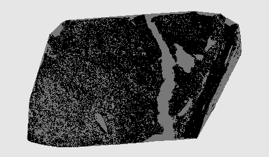
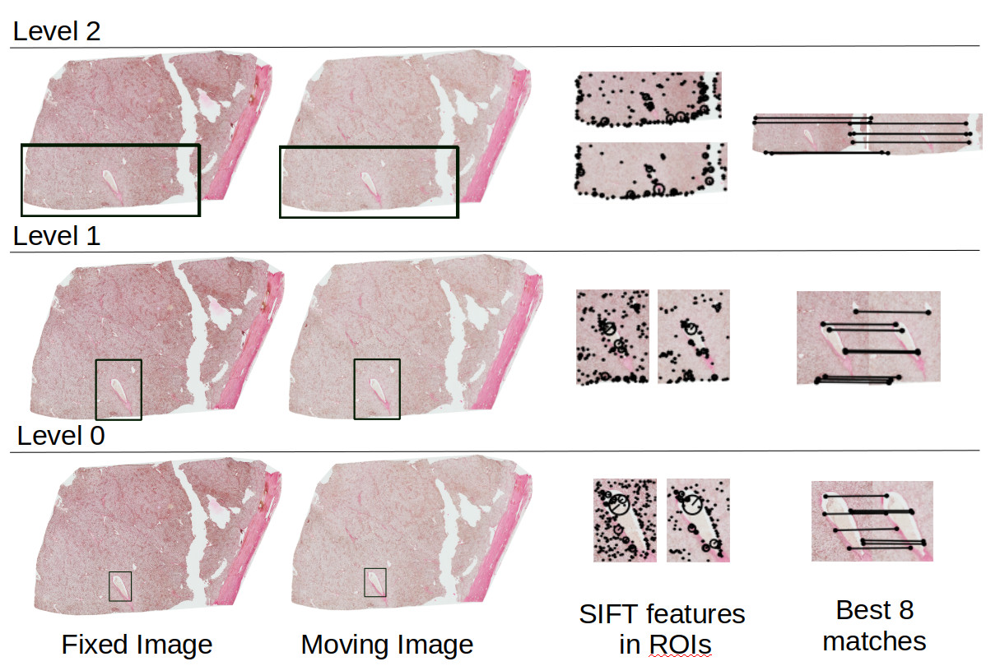

# WSIRegistration

This repository contains the c++ code for the paper:
*"Regional Registration of Whole Slide Image Stacks Containing Major Histological Artifacts"* submitted to BMC Bioinformatics Journal. 
Opencv-3.4.1 and Opencv_contrib3.4.1 libraries were used for this implementation. 
The executable file named gray-levels performs Mumford-Shah segmentation.

# Motivation:

In order to register a region of interest (ROI) in the whole slide images, three steps are carried out as follows: 1) Removing surrounding artifacts, 2) Rough alignment of consecutive tissue slides, and 3) Registration of user-defined ROI. 

# 1) Removing surrounding artifacts
Extra stains and artifacts around the tissue can affect the registration outcome. To remove these artifacts, each image is converted to the gray scale and smoothed using a Gaussian filter. The smoothed image is then thresholded. Since an accurate segmentation of the tissue from the surrounding artifacts cannot be achieved merely by thresholding, an opening and later a closing morphological operation was applied on the output mask from thresholding to get a mask that covers the artifacts and extra stains around the tissue. The final segmentation mask is applied to the image to remove the surrounding artifacts. Contours in the new image are then detected. The contours which are closer to the center of the image and surround the largest area in the image are identified. Extra tissue and stains outside the convex hull of the selected contours are removed, resulting in a cleaned tissue image. 

Original Image             |  Thresholded Image        | Selected Edges            | Convex Hull of Edges      | Cleaned Image
:-------------------------:|:-------------------------:|:-------------------------:|:-------------------------:|:-------------------------:
 |  |  |  |  
 

# 2) Rough alignment of consecutive tissue slides
In this stage, relative rotations or displacements in the location of the tissue across consecutive virtual slides are corrected. The cleaned image, is segmented using a multi-resolution Monte Carlo method (gray-level file). Next, each consecutive pair of Mumford-Shah segmented images are registered in a single scale independently. For each pair of images, a combination of varying translation  and rotation () transformations are applied to the second (moving) image to find the rotation and translation parameters which make transformed moving image most similar to the fixed image.
The  triplet which gives the least sum of squared difference is chosen and its corresponding transformation matrix is applied to the moving image.  

 Clean Fixed Image            |  Clean Moving Image        | Mumford Fixed Segmentation            | Mumford Moving Segmentation      | Mumford Moving Registered        | Clean Moving Registered
:-------------------------:|:-------------------------:|:-------------------------:|:-------------------------:|:-----------------------:|:-------------------------:
 |  |  |  |  |  

# 3) Registration of user-defined ROI
This stage of the algorithm is multi-scale. A small box around the region of interest is defined by the user for the image at its full resolution. In order to register two image slices, registration is first performed for lower resolutions of the two images. Having extracted the region of interest in the lowest resolution images, distinctive key points are detected in both ROIs using SIFT feature detection algorithm. The top 8 matches are selected. Since registration is performed locally, a rigid registration is found sufficient. A rigid transformation can be calculated with a minimum of 3 key points per image. Therefore, 56 different combinations of 3 matches and consequently, 56 different transformation matrices can be obtained using the 8 selected matches. All the transformations are applied to the images giving a series of 56 warped images. The transformation matrix which gives the smallest sum of squared difference in pixel intensity is chosen. The same procedure is done on higher resolution of the images. 

 

 
 # Paper
 Please cite our paper: 
 
 Paknezhad, M., Loh, S. Y. M., Choudhury, Y., Koh, V. K. C., Yong, T. T. K., Tan, H. S., ... & Lee, H. K. (2020). Regional registration of whole slide image stacks containing major histological artifacts. BMC bioinformatics, 21(1), 1-20.

